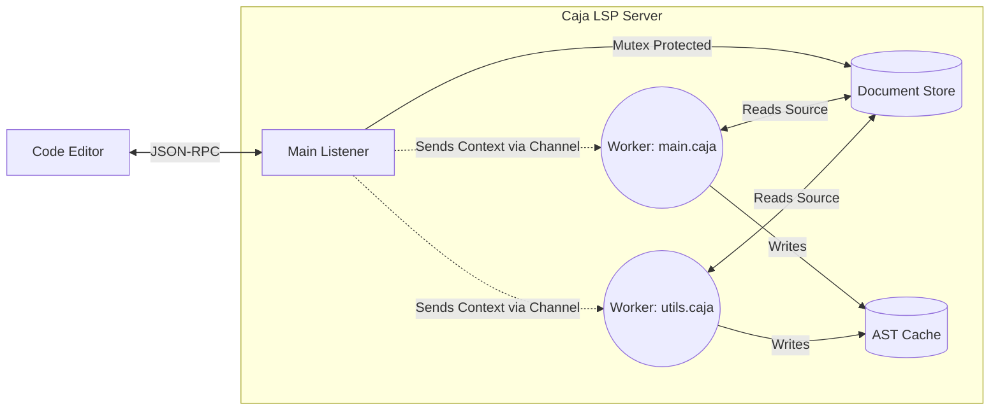
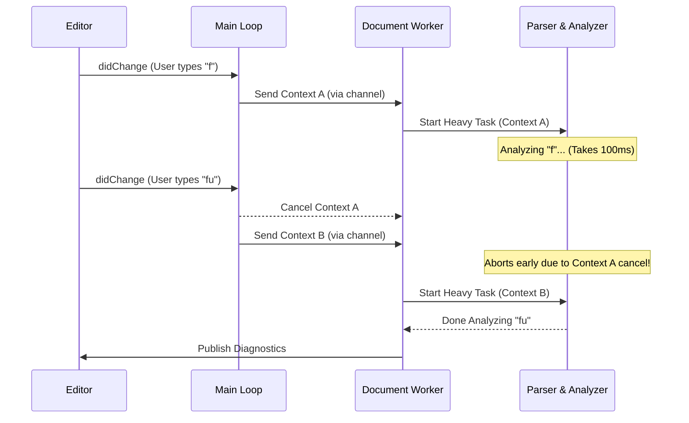

The Language Server Protocol (LSP) implementation for Caja provides deep editor integration, enabling intelligent code features across modern IDEs like VS Code. 

## Communication and Libraries
At its core, the LSP communicates with the editor via JSON-RPC over standard input and output streams. To handle the complex framing, serialization, and routing of these JSON-RPC messages, the project utilizes the [`github.com/owenrumney/go-lsp`](https://github.com/owenrumney/go-lsp) Go library. This robust dependency abstracts away the boilerplate of the JSON-RPC spec, allowing our language server to focus purely on language semantics.

## Supported Features
The Caja language server currently implements the following intelligent features:
- **Go to Definition**: Allows developers to `Ctrl+Click` (or `Cmd+Click`) on a variable, function, or type to instantly navigate to where it was originally defined.
- **Hover**: Displays rich documentation, type information, and signatures in a tooltip when the cursor rests over a token.
- **Signature Help**: Automatically pops up function parameter hints and signatures while the user is typing arguments inside a function call.
- **Live Diagnosis**: Continuously analyzes the code in the background as the user types, highlighting syntax errors, semantic issues, and warnings directly in the editor in real-time.

## Architecture & Concurrency Model

### The Document Store
Before code can be analyzed, it must be stored in memory. The **Document Store** acts as a virtual file system that sits between the editor and the compiler. Every time the user opens or modifies a file, the editor sends the latest source text over JSON-RPC. The Document Store saves this text in a centralized map protected by a global `sync.RWMutex`, ensuring that background processes always have access to the most up-to-date code without needing to read from the physical hard drive.

### The Single Worker Pattern
Language servers receive a massive stream of requests from the editor—every single keystroke triggers document synchronizations and diagnostic requests. If the server were to process these sequentially on the main listener thread, the message queue would rapidly back up, causing severe UI lag and a degraded developer experience. Conversely, if every request unconditionally spawned an unmanaged background thread, it would lead to chaotic out-of-order execution and race conditions.

To guarantee both high performance and perfect state consistency, the Caja LSP heavily leverages Go's concurrency model by employing a **Single Worker Pattern** per document. 

**Why we chose this pattern:**
1. **Sequential Consistency**: By channeling events (like keystrokes) into a dedicated worker goroutine via channels, we guarantee that tasks are processed in the exact order they were received. This eliminates the risk of an older document state accidentally overwriting a newer one.
2. **Simplified Locking**: While a global `sync.RWMutex` protects shared data structures (like the active worker map and AST cache), the single worker ensures that AST parsing and semantic analysis for a specific file always run sequentially. This means we don't need granular locks deeply embedded within the AST nodes themselves.
3. **Responsive Main Loop**: The main JSON-RPC listener loop only parses incoming network messages and pushes them into the worker's queue. This ensures the main loop is never blocked by expensive AST traversals or semantic checks, keeping the editor incredibly responsive.

### Synchronization and Memory Safety
Even with a single worker pattern, there is a risk of resource exhaustion or processing stale data (e.g., spending CPU cycles running diagnostics on an AST that was invalidated a millisecond later by a new keystroke).

To solve this, the LSP architecture enforces strict task synchronization:
- **Context Cancellation**: Heavy asynchronous tasks are bound to cancellation contexts (`context.Context`). If the editor sends a newer request (invalidating a previous diagnostic run), the context for the stale task is immediately canceled. The tasks actively listen for the `ctx.Done()` signal and gracefully terminate early, freeing up CPU and memory resources instantly.
- **Graceful Shutdown**: When a document is closed or the server stops, the worker's channel is closed, allowing the worker goroutine to flush its state and shut down cleanly, completely preventing goroutine leaks.

